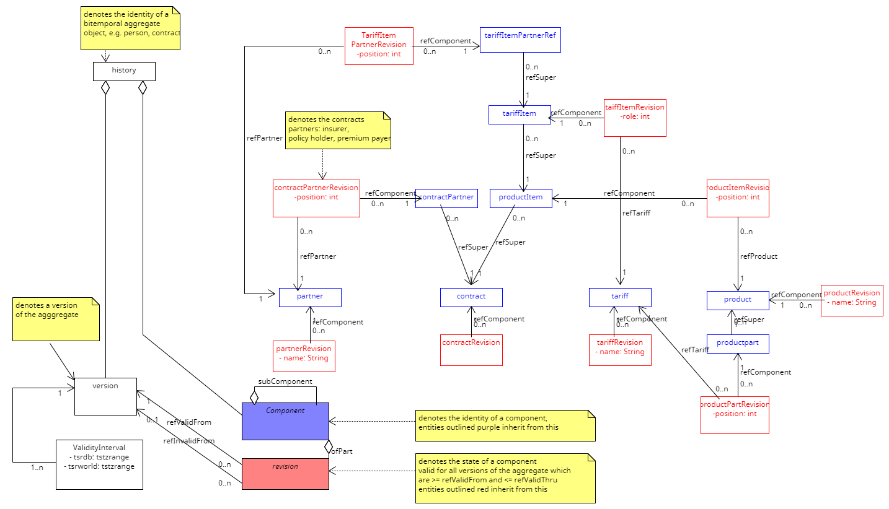

This is a prototype model for bitemporal data management based on [a Julia bitemporal data management API](https://github.com/michaelfliegner/BitemporalPostgres.jl)

It is intended to provide persistence for [this Webapp](https://github.com/michaelfliegner/BitemporalReactive.jl)

The Data Model of the prototype. This is - as of now - all about versioning of entities and relationships for a Life Insurance app - domain specific attributes will be added when calculations will come into play.

Features are: 
- populating the database 
- displaying contract versions and history

 

  
